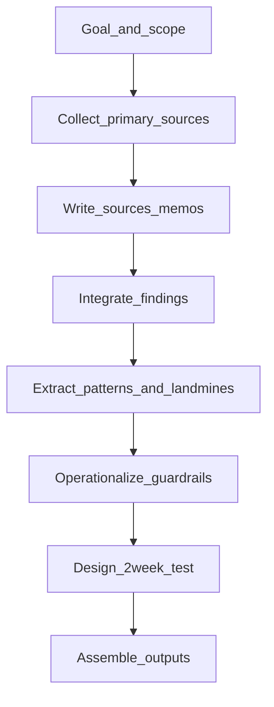

---

## title: 個人ブランディング戦略検証｜プロセスレポート（コーディングエージェント（Cursor）活用）
as_of: 2026-04-16
status: draft
audience: カンパニーCEO（初見想定）

## 0. 位置づけ

本レポートは、戦略の是非そのものではなく、「今回の調査・検討をどう進めたか」「なぜこの手順にしたか」「どの成果物がどの判断に接続しているか」を説明する。

---

## 1. 目的（なぜコーディングエージェント（Cursor）を全面利用したか）

- 調査・検討を“属人的な読み物”にせず、**一次根拠に辿れる構造**を保ったままスピーディに更新できるかを確認する。
- 失敗事例（表示規制/許認可/信用危機）を「注意喚起」ではなく、**運用ルール（チェック）として実装**まで落とせるかを検証する。

---

## 2. 進め方の型（今回採用したワークフロー）

### 2.1 原則

- 一次情報優先（公式サイト、本人発信、動画、プロフィール、公的機関等）
- 取れない情報は「未確認/見当たらず」を明記（後から断言に変質させない）
- 「収集」→「統合」→「意思決定」→「ガードレール」→「検証設計」→「提出物」の順に段階化

### 2.2 手順（入力→探索→確定→統合→提出）

- **Collect_primary_sources / Write_sources_memos**
  - 成功/失敗の一次根拠を収集し、数値や文言を「引用可能な形」でメモ化（観測日付も残す）
  - 目的: 後段の判断（勝ちパターン/地雷/検証設計）が“どの一次根拠に基づくか”を追えるようにする
- **Integrate_findings / Extract_patterns_and_landmines**
  - 先行例の「約束」「信頼の根拠」「導線」「リスク」「スケール」を同一軸で比較し、移植できる要素/危険な要素を抽出
- **Operationalize_guardrails**
  - 失敗事例から、表示統制（景表法）、許認可の“根”、信用危機の初動を、運用チェックに落とす
- **Design_2week_test**
  - 「受容性（相談したい）」「工数対効果」「独自性（指名理由）」を2週間で判断できる最小実験に分解
- **Assemble_outputs**
  - Google Docへ貼り付けて読める形（本文・プロセス・ソース集約）に編集して提出可能にする

---

## 3. 成果物（アウトプット）の関係

### 3.1 提出物（Google Doc貼り付け用：3点）

- 暫定レポート（本文）: `05_outputs/2026-04-16_interim_report_for_google_doc.md`
- プロセスレポート（本書）: `05_outputs/2026-04-16_process_report_for_google_doc.md`
- 調査収集情報（ソース集約）: `05_outputs/2026-04-16_research_sources_dump_for_google_doc.md`

### 3.2 内部成果物（作業ログ/詳細）

- 一次根拠メモ（成功/失敗）: `01_research/sources/2026-04-16_*.md`
- 統合（勝ちパターン/地雷）: `03_analysis/win_patterns_and_landmines.md`
- 検証設計（2週間）: `04_insights/concept_test_plan.md`
- ガードレール（運用チェック）: `05_outputs/appendix_guardrails_checklist.md`

---

## 4. 今回得た学び（再現性/ボトルネック/次回改善）

### 4.1 再現性が上がった点

- 一次根拠メモを先に作ることで、「結論→根拠」が後からでも追跡できる
- 失敗事例をチェックリスト化することで、検証フェーズに進んだ後も“守るべき線”を運用できる

### 4.2 ボトルネックになりやすい点

- 数値訴求は、算出条件（定義/母数/期間/例外/比較対象）が欠けると、後工程で断言リスクになりやすい
  - 対策: 未確認/見当たらずを明記し、条件付き要素として扱う

### 4.3 次回改善（運用としてのアップデート案）

- 2週間検証を「実日付カレンダー」「ログの取り方」「週次レビュー手順」まで落とし、実行摩擦を下げる
- 表示統制/情報取扱い/利益相反/初動を、承認フロー（誰が最終OKか）に接続する

