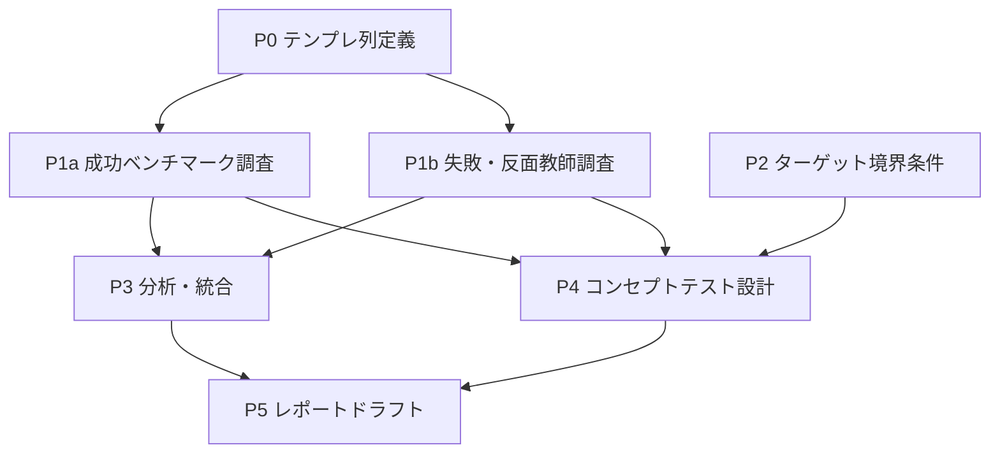

## ゴール（このプランの終着点）

- 代表・ステークホルダーが **Go / No-Go / 修正** を判断できる根拠が、`report_outline.md` の構成に沿って揃っている。
- 一次情報（公式・本人発信・導線）に基づく **比較可能なベンチマーク表** と、**反面教師**、**ターゲット境界**、**検証設計** が揃っている。

## 成果物の置き場（運用）

| 種類 | 置き場（推奨） |
| --- | --- |
| URL・スクショ・生データのメモ | `01_research/sources/` |
| 読み解き・要約・比較表 | `01_research/notes/` |
| 施策案の発散 | `02_ideation/` |
| フレーム整理（ポジション・チャネル等） | `03_analysis/` |
| 示唆・優先順位・リスク | `04_insights/` |
| 提出用ドラフト・計画書 | `05_outputs/` |

---

## フェーズ一覧（順番の目安）

| ID | フェーズ | 主なアウトプット | 完了の目安 |
| --- | --- | --- | --- |
| P0 | フォーマット固定 | 比較用の列定義・テンプレ1枚 | 誰が見ても同じ軸で埋められる |
| P1 | デスクリサーチ（並行可） | 成功例・失敗例の一次整理 | テンプレに「事実ベース」で追記できる |
| P2 | ターゲット境界の確定 | 原石層の定義1枚＋NG例 | コンセプトテストの文言がブレない |
| P3 | 分析・統合 | 勝ちパターン／地雷の抽出 | `03_analysis/` に比較・含意がまとまる |
| P4 | 検証設計 | コンセプトテスト案＋成功基準 | 実行に移せる粒度 |
| P5 | レポート化 | `report_outline.md` 沿いのドラフト | 提出レビュー可能 |

**次セッションの着手点**：**P0 完了 → P1a（成功ベンチマーク表）の1行目から埋める** か、**P1b（失敗事例）を別ファイルで並行開始** のどちらでもよい（依存は下記）。

---

## 依存関係（何が何の前提か）

### 文章での依存（簡潔）

1. **P0 は P1a / P1b の直前に必須**  
   列が揃っていないと、あとから表を作り直すコストが大きい。

2. **P1a と P1b は P0 さえあれば相互に独立**  
   別担当・別セッションで並行してよい（ソースのファイル名だけ衝突しないように分ける）。

3. **P2（ターゲット境界）は P1 と独立して並行可能**  
   ただし **P4（コンセプトテスト）を書き切る** には、P2 と P1 の「ターゲットが誰に刺さるか」の知見が両方ある方が筋が良い。  
   → **P2 を P1 と並行で進め、P4 の前に P2 を必ずマージ**する運用がよい。

4. **P3 は P1a・P1b の「一次整理」がそろってから**  
   途中版でもメモは書けるが、「統合した結論」としては P1 の表が一定埋まってから。

5. **P5 は P3 と P4 のドラフトが揃ってから**が効率的。  
   （P3 だけ先に書くと、検証章が薄くなる。）

---

## 並行して進められる作業（推奨パック）

### パック A（調査メイン・2系統）

| 並行タスク | 内容 | 前提 |
| --- | --- | --- |
| **A1** | 成功ベンチマーク（要件の3件＋補助で最大5名程度）をテンプレで埋める | P0 |
| **A2** | 失敗・反面教師3件を同テンプレ（または「失敗用」にリスク列を厚くした派生テンプレ）で埋める | P0 |

→ **同一セッション内**でも、A1 と A2 を交互に1行ずつ進めるとコンテキスト切替で疲れるので、**セッションを分ける**か、**別ファイル**（`notes/benchmarks_success.md` / `notes/benchmarks_failure.md`）にする。

### パック B（定義メイン・調査と独立）

| 並行タスク | 内容 | 前提 |
| --- | --- | --- |
| **B1** | 原石層の境界条件（年齢・年数・職種・「くすぶり」の定義・除外する層）を1枚にする | なし（inbox の要件で開始可） |
| **B2** | 代表への確認事項リストの整理（中間レポートの末尾＋要件の再ヒアリングメモを1つに） | なし |

→ B1 は **P1 と同時進行で問題なし**。B2 は **インタビュー前**に仕上げると P2・P4 が速くなる。

### パック C（P1 完了後〜P3 並行）

| 並行タスク | 内容 | 前提 |
| --- | --- | --- |
| **C1** | 勝ちパターンの分解（`03_analysis/`） | P1a の表が7割以上埋まっている |
| **C2** | 地雷・炎上パターンの整理（`04_insights/` でも可） | P1b が7割以上 |

→ C1 と C2 は **P3 手前で並行可能**。

---

## 各フェーズのチェックリスト

### P0：比較テンプレの固定（次セッション最初の15〜30分想定）

- [ ] 列を確定する（最低限の例）  
  - 対象名 / 事業・サービス名  
  - **約束**（候補者に対して何を約束しているか）  
  - **信頼の根拠**（実績・専門性・透明性・人格・第三者評価 等）  
  - **導線**（認知チャネル → 低摩擦入口 → 商談）  
  - **リスク**（拒絶・炎上・期待差・コンプラ）  
  - **スケール**（個人→組織への移管、品質の守り方）  
- [ ] `01_research/notes/` にテンプレを1ファイル保存（例：`benchmark_comparison_template.md`）

### P1a：成功ベンチマーク

- [ ] 中間レポートの候補から優先順位付け
- [ ] 各人について一次情報を `sources/` にリンク集約
- [ ] テンプレ全列を埋める（推測は推測と明記）

### P1b：失敗・反面教師

- [ ] 3件の候補を挙げ、要件の観点（肩書き依存・数だけ取れて質が落ちた等）に紐づける
- [ ] P1a と同様に一次情報・テンプレで整理

### P2：ターゲット境界

- [ ] 「原石層」の定義を一文＋箇条書き条件にする
- [ ] NG層（狙わない人）を明示
- [ ] 代表の支援密度・プロダクト仮説と矛盾がないかメモ

### P3：分析・統合

- [ ] 自社（HKZ想定）との比較：**使える要素 / 危険な要素**
- [ ] 戦略類型 A/B/C のどこに寄せるかの根拠更新（中間レポートの仮説を検証で上書き）

### P4：検証設計

- [ ] コンセプトテスト案（媒体・投稿タイプ・CTA）
- [ ] 成功基準（「この人に相談したい」等の**具体例**が何件出たらGo寄りか）
- [ ] 工数シミュレーション（代表の週次時間の上限仮置き）

### P5：レポート化

- [ ] `report_outline.md` の見出しに沿ってドラフト
- [ ] 未確定は「要確認」と代表ヒアリング項目に逃がさない

---

## 次セッション用：最初にやるコマンド（そのまま使える）

1. `01_research/notes/benchmark_comparison_template.md` を新規作成し、上記 P0 の列で空表を置く。  
2. 中間レポートのベンチマーク1名分から、**1行ではなく1人1セクション**で詳細に埋める（表が大きい場合はこの形式でも可。後で表に圧縮）。  
3. 並行したい場合は、別ブランチの作業ではなく **別ファイル** で A2 か B1 を開く。

---

## 変更履歴

| 日付 | 内容 |
| --- | --- |
| 2026-04-16 | 初版作成（進行計画・依存・並行パック） |
