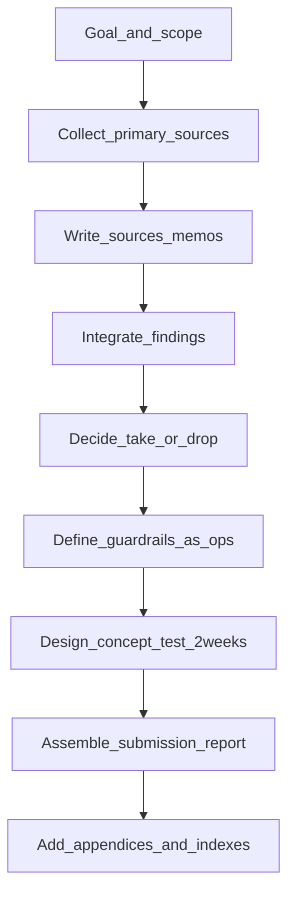

## 1. 目的（なぜ“コーディングエージェント（Cursor）全面利用”を試したか）

- 本プロジェクトは、個人ブランディング戦略の検討に加えて、**コーディングエージェント（Cursor）を調査作業に全面利用した場合の再現性**（速さ/漏れ/根拠の辿りやすさ/運用化のしやすさ）を確認するテストでもある。
- “それっぽい結論”より、**一次根拠へ辿れる構造**と、失敗事例からの**ガードレール実装**までをセットで作ることを狙った。

---

## 2. 進め方の型（今回採用したワークフロー）

### 2.1 原則

- **一次情報の集約**: 一次根拠の追記先を `01_research/sources/` に統一する
- **未確認の明示**: 取れなかった条件/算出根拠は「見当たらず/未確認」を明記する（後で“断言”にならないように）
- **判断の形に落とす**: 収集→統合→意思決定（採る/捨てる/条件付き）→運用ルール（ガードレール）→検証設計→提出物、の順で段階化する

### 2.2 手順（入力→探索→確定→統合→提出）

- **Collect_primary_sources**: 成功/失敗ベンチマークの一次根拠を回収
  - 出力: `01_research/sources/2026-04-16_*.md`、必要に応じてPDF保存
- **Integrate_findings**: “勝ちパターン/地雷”を抽出し、HKZへ移植判断へ
  - 出力: `03_analysis/win_patterns_and_landmines.md`
- **Define_guardrails_as_ops**: 反面教師（景表法/許認可/信用危機）を、運用チェックとして“実装”へ
  - 出力: `05_outputs/appendix_guardrails_checklist.md`（提出用）
- **Design_concept_test_2weeks**: 受容性・工数対効果・独自性を2週間で判断できる設計へ
  - 出力: `04_insights/concept_test_plan.md`
- **Assemble_submission_report**: 社内意思決定に必要な導線（結論→根拠→次アクション）を整形
  - 出力: `05_outputs/report_draft.md`
- **Add_appendices_and_indexes**: 根拠の辿りやすさ（迷子防止）を付録で補強
  - 出力: `05_outputs/appendix_sources_index.md`、`05_outputs/appendix_guardrails_checklist.md`

---

## 3. 成果物マップ（どのファイルが何の役割か）

### 3.1 提出物（社内）

- 戦略レポート（提出用｜プレ最終版）: `05_outputs/report_draft.md`
- 付録（ガードレール運用チェック）: `05_outputs/appendix_guardrails_checklist.md`
- 付録（一次根拠インデックス）: `05_outputs/appendix_sources_index.md`

### 3.2 収集物（一次根拠）

- 一次根拠メモ（成功/失敗）: `01_research/sources/2026-04-16_*.md`
- ローカル保存PDF（景表法関連）: `01_research/sources/caa_representation_cms207_220427_01.pdf` / `_02.pdf`

### 3.3 統合・運用（意思決定/検証設計）

- 採る/捨てる/条件付き（統合判断）: `03_analysis/win_patterns_and_landmines.md`
- ターゲット境界（原石層）: `03_analysis/target_boundary.md`
- 検証設計（2週間）: `04_insights/concept_test_plan.md`
- 前提確定の質問票（代表ヒアリング）: `04_insights/representative_interview_one_pager.md`

---

## 4. 今回得た学び（再現性/ボトルネック/次回改善）

### 4.1 再現性が高かった点

- 一次根拠を `01_research/sources/` に集約したことで、**「結論→一次」への追跡性**が上がった
- 失敗事例を“注意喚起”ではなく、**チェックリスト（運用）**に落とすことで、提出後の実行に接続できた

### 4.2 ボトルネックになりやすい点

- 一次で算出条件が取れない数値訴求は、放置すると後段（レポート/発信）で**断言リスク**になる
  - 対策: 未確認/見当たらずを早い段階で明記し、条件付き要素へ落とす

### 4.3 次回改善（運用としてのアップデート案）

- 2週間検証（P4）を「実日付カレンダー」「ログの取り方」「週次レビュー手順」まで落とし、**実行の摩擦をさらに下げる**
- “表示統制チェック”“情報取扱い/利益相反/初動”を、社内の承認フロー（誰が最終OKか）に接続する

